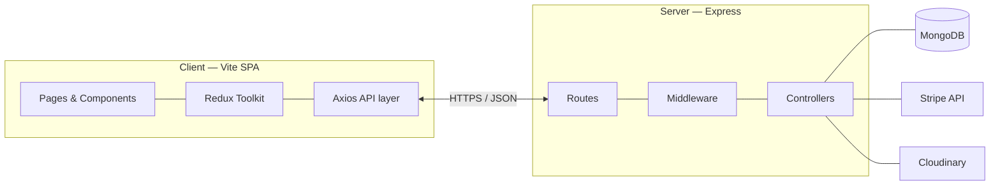

<div align="center">

# LUXE Commerce

**Full-stack e-commerce platform** — premium React storefront, REST API, MongoDB persistence, Stripe payments, and role-based administration.

[](https://nodejs.org/)
[](https://react.dev/)
[](LICENSE)

</div>

---

## Table of contents

1. [Overview](#overview)
2. [Architecture](#architecture)
3. [Repository layout](#repository-layout)
4. [Technology](#technology)
5. [Getting started](#getting-started)
6. [Configuration](#configuration)
7. [Scripts](#scripts)
8. [API](#api-summary)
9. [Frontend routing](#frontend-routing)
10. [Security \& operations](#security--operations)
11. [Building for production](#building-for-production)
12. [Deployment](#deployment)
13. [Roadmap \& extension points](#roadmap--extension-points)
14. [License](#license)
15. [Contributing \& changelog](#contributing--changelog)

---

## Overview

**LUXE Commerce** is a production-oriented monorepo: a **Vite + React** client with **Redux Toolkit**, **Tailwind CSS**, and motion/UX primitives (Framer Motion, GSAP, Lenis, Swiper), backed by an **Express** API on **MongoDB** (Mongoose). Core capabilities include catalogue browsing with filters and search, cart and wishlist, authenticated checkout via **Stripe**, order history, product reviews, coupon application, Cloudinary-backed media uploads, and an admin console with charts (Recharts).

| Audience | Capability |
|----------|-------------|
| **Shoppers** | Browse, filter, wishlist, cart, checkout, orders, profile, reviews |
| **Operators** | Product/order/user/category/coupon management, dashboard metrics |
| **Engineers** | REST API, seeded data, env-driven config, SPA + API separation |

---

## Architecture

High-level request flow:



**Authentication:** JWT is issued on login/register. The API supports the token via **HTTP-only cookie** (`generateToken`) and **`Authorization: Bearer`** (SPA uses localStorage + header for portability across hosts). Middleware resolves either source.

---

## Repository layout

```
E-Commerce-Website/
├── client/                    # SPA (React 18, Vite)
│   ├── src/
│   │   ├── components/
│   │   │   ├── layout/       # Header, Footer, Cart drawer, Mobile nav, Cursor, etc.
│   │   │   ├── home/         # Hero, sale banner, marquee, testimonials, newsletter
│   │   │   └── ui/           # Buttons, badges, ProductCard, modals, skeletons
│   │   ├── data/             # Static product catalogue fallback
│   │   ├── hooks/
│   │   ├── pages/            # Public + authenticated + admin/
│   │   ├── providers/
│   │   ├── store/            # Redux slices, Axios API client
│   │   ├── styles/
│   │   ├── App.jsx
│   │   └── main.jsx
│   └── package.json
├── server/                    # Express API
│   ├── config/
│   ├── controllers/
│   ├── middleware/
│   ├── models/
│   ├── routes/
│   ├── utils/
│   ├── data/                  # Seed JSON — categories & products
│   ├── seeder.js
│   └── server.js
├── .env.example               # Canonical env template
├── package.json               # Workspace scripts (concurrently)
└── README.md
```

---

## Technology

### Client

| Area | Choices |
|------|---------|
| Runtime / build | React 18, Vite 5, ES modules |
| Styling | Tailwind CSS 3, design tokens (`luxury` palette), custom animations CSS |
| State | Redux Toolkit, react-redux |
| Routing | react-router-dom 6 (`React.lazy`, `Suspense`) |
| Data | Axios (`VITE_API_URL`), localStorage-backed cart wishlist UX |
| Motion / UX | Framer Motion, GSAP + `@gsap/react`, Lenis, Swiper, react-countup |
| Payments UI | Stripe.js (`@stripe/react-stripe-js`) |
| Visualization | Recharts (admin dashboard) |

### Server

| Area | Choices |
|------|---------|
| Runtime | Node.js 18+, Express 4 |
| Data | MongoDB, Mongoose 8 |
| Auth | JWT, bcryptjs, cookie-parser |
| Validation / hardening | express-validator, Helmet, express-rate-limit, express-mongo-sanitize |
| Payments | Stripe server SDK |
| Media | Cloudinary, Multer uploads |
| Email | Nodemailer (SMTP) |

---

## Getting started

### Prerequisites

- **Node.js** ≥ 18 and **npm**
- **MongoDB** (local [`mongod`](https://www.mongodb.com/try/download/community) or [Atlas](https://www.mongodb.com/cloud/atlas))
- Optional for full parity: **Cloudinary**, **Stripe** (test keys), **SMTP** credentials

### Install

```bash
git clone <your-fork-url> E-Commerce-Website
cd E-Commerce-Website
npm run install-all
```

### Configure

Copy [.env.example](.env.example) to `.env` at the repo root (or split per convention your team prefers; templates live in [.env.example](.env.example)).

### Seed database

```bash
npm run seed
```

Seeds five categories, **25** curated products (INR pricing, dual images metadata), demo users, and sample coupons (`WELCOME10`, `SAVE20`, `MEGA50`).

**Seed logins (matches [server/seeder.js](server/seeder.js))**

| Role | Email | Password |
|------|--------|----------|
| Admin | `admin@luxe.shop` | `admin123` |
| User | `john@luxe.shop` | `password123` |

Re-seed after email changes **or** update existing MongoDB users manually. To wipe seeded collections (destructive):

```bash
cd server && npm run seed:destroy
```

### Run development

```bash
npm run dev
```

| Service | URL |
|---------|-----|
| Client | [http://localhost:5173](http://localhost:5173) |
| API prefix | `http://localhost:5000/api` (depends on `PORT` / `VITE_API_URL`) |

---

## Configuration

Minimal reference (see [.env.example](.env.example) for the full list):

| Variable | Role |
|---------|------|
| `MONGO_URI` | MongoDB connection string |
| `JWT_SECRET`, `JWT_EXPIRE`, `JWT_COOKIE_EXPIRE` | JWT signing and cookie lifetime |
| `CLOUDINARY_*` | Image upload pipeline |
| `STRIPE_SECRET_KEY`, `STRIPE_WEBHOOK_SECRET` | Payment intent & webhooks |
| `SMTP_*`, `CLIENT_URL` | Transactional mail & CORS / links |
| `VITE_API_URL` | Axios base URL in the client |
| `VITE_STRIPE_PUBLISHABLE_KEY` | Stripe Elements |

**Important:** Never commit `.env`. Treat secrets as rotational and scope Stripe keys per environment (`test` vs `live`).

---

## Scripts

| Command | Scope | Description |
|---------|-------|-------------|
| `npm run install-all` | Root | Installs root, `server`, and `client` dependencies |
| `npm run dev` | Root | Starts API + SPA via `concurrently` |
| `npm run client` | Client | `vite` dev server |
| `npm run server` | Server | `nodemon server.js` |
| `npm run build` | Client | `vite build` → `client/dist` |
| `npm run seed` | Server | Runs `node seeder.js` |
| `cd server && npm start` | Server | Production: `node server.js` |

---

## API summary

Base path: `/api` (unless reverse-proxied).

| Domain | Examples | Access |
|--------|----------|--------|
| Auth | `POST /auth/register`, `POST /auth/login`, `GET /auth/me` | Mixed |
| Products | `GET /products`, `GET /products/:id`, `GET /products/featured` | Public read; admin write |
| Orders | `POST /orders`, `GET /orders/myorders`, `PUT /orders/:id/status` | User / Admin |
| Reviews | `POST /reviews/:productId` | Authenticated |
| Categories, Coupons, Users, Upload, Payment | See `server/routes/` | Role-gated as implemented |

For authoritative route lists and payloads, inspect `server/routes/*.js` and matching controllers.

---

## Frontend routing

Public and lazy-loaded routes include: `/`, `/products`, `/product/:id`, `/search`, `/cart`, `/login`, `/register`, password reset, **`/wishlist`**, **`/checkout`**, **`/orders`**, **`/profile`**, and **`/admin/*`** behind admin layout / role checks. Protected routes mirror server expectations (redirect to `/login` when unauthenticated).

---

## Security & operations

- Passwords hashed with **bcrypt**; JWTs validated in middleware with optional cookie + Bearer support.
- **Helmet**, **mongo-sanitize**, **rate limiting**, **CORS**, and validation middleware reduce common web/API risks.
- Run API behind HTTPS in production; align `CLIENT_URL`, cookie `secure` flags, and CORS origins with your hostname.
- Configure **Stripe webhooks** in the dashboard when going live (`STRIPE_WEBHOOK_SECRET`).

Operational checklist before production:

1. Rotate all secrets; use separate Stripe/Cloudinary projects per env.
2. Enable structured logging/metrics (APM) — not bundled; plug in ELK/DataDog/AWS CloudWatch per org standard.
3. Add automated tests (`client`/`server`), CI pipelines, and branch protection — recommended next increment.

---

## Building for production

```bash
npm run build
```

Artifacts: `client/dist`. Serve statically (CDN, nginx, object storage + edge) and point `VITE_API_URL` at the deployed API.

---

## Deployment

Typical split deployment:

| Component | Platforms (examples) | Notes |
|-----------|---------------------|-------|
| **Client** | Vercel, Netlify, S3 + CloudFront | Root = `client`, build = `npm run build`, inject `VITE_*` env |
| **Server** | Render, Railway, Fly.io, AWS ECS/Fargate | Root = `server`, `npm ci && npm start`, pass full `.env` |
| **MongoDB** | Atlas / self-hosted | Prefer replica set for HA |

Ensure `CLIENT_URL`, CORS, and Stripe redirect URLs reflect production domains.

---

## Roadmap & extension points

Suggested engineering upgrades (ordered by leverage):

1. **Testing** — Vitest + RTL for client; Jest/Supertest for critical API paths.
2. **Observability** — correlation IDs, request logging, Stripe webhook replay handling.
3. **Checkout** — idempotent order creation, inventory reservation semantics.
4. **i18n / multi-currency** — extend catalogue model beyond INR where needed.

---

## Contributing & changelog

- **[CONTRIBUTING.md](CONTRIBUTING.md)** — branching, PR expectations, coding standards, security reporting.
- **[CHANGELOG.md](CHANGELOG.md)** — release history and `[Unreleased]` notes (Keep a Changelog style).

---

## License

Distributed under the **MIT License** (add a `LICENSE` file at the repo root to make terms explicit).

---

<div align="center">

**Maintainers:** Document breaking API changes here or in `CHANGELOG.md` when you introduce them.

</div>
